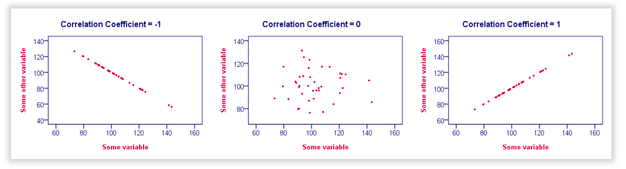
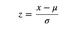
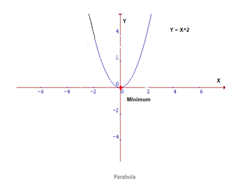
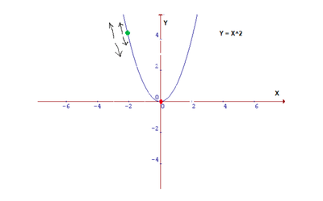
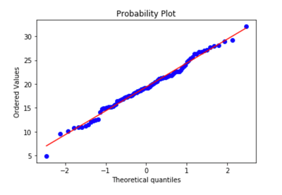
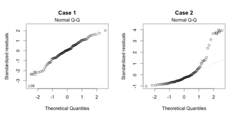

- [1. Explain the linear regression algorithm in detail.](#1-explain-the-linear-regression-algorithm-in-detail)
    - [Simple linear regression](#simple-linear-regression)
      - [Estimate the relevancy of the coefficients](#estimate-the-relevancy-of-the-coefficients)
      - [Assess the accuracy of the model](#assess-the-accuracy-of-the-model)
    - [Multiple linear regression](#multiple-linear-regression)
      - [Assess the relevancy of a predictor](#assess-the-relevancy-of-a-predictor)
      - [Assess the accuracy of the model](#assess-the-accuracy-of-the-model-1)
    - [Assumption for the linear regression](#assumption-for-the-linear-regression)
- [2. What are the assumptions of linear regression regarding residuals?](#2-what-are-the-assumptions-of-linear-regression-regarding-residuals)
    - [**The regression model is linear in parameters**](#the-regression-model-is-linear-in-parameters)
      - [Check](#check)
    - [**No autocorrelation of residuals**](#no-autocorrelation-of-residuals)
      - [Check](#check-1)
    - [**No perfect multicollinearity**](#no-perfect-multicollinearity)
      - [Check](#check-2)
    - [**Homoscedasticity of residuals or equal variance**](#homoscedasticity-of-residuals-or-equal-variance)
      - [Check](#check-3)
    - [**The error terms must be normally distributed**](#the-error-terms-must-be-normally-distributed)
      - [Check](#check-4)
    - [**The number of observations must be greater than number of Xs**](#the-number-of-observations-must-be-greater-than-number-of-xs)
- [3. What is the coefficient of correlation and the coefficient of determination?](#3-what-is-the-coefficient-of-correlation-and-the-coefficient-of-determination)
    - [**Coefficient of correlation**](#coefficient-of-correlation)
    - [**Coefficient of determination**](#coefficient-of-determination)
- [4. Explain the Anscombe’s quartet in detail.](#4-explain-the-anscombes-quartet-in-detail)
- [5. What is Pearson’s R?](#5-what-is-pearsons-r)
- [6. What is scaling? Why is scaling performed? What is the difference between normalized scaling and standardized scaling?](#6-what-is-scaling-why-is-scaling-performed-what-is-the-difference-between-normalized-scaling-and-standardized-scaling)
    - [**What is scaling?**](#what-is-scaling)
    - [**Why is scaling performed?**](#why-is-scaling-performed)
    - [**What is the difference between normalized scaling and standardized scaling?**](#what-is-the-difference-between-normalized-scaling-and-standardized-scaling)
      - [**Normalized scaling**](#normalized-scaling)
      - [**Standardized scaling**](#standardized-scaling)
      - [**Difference**](#difference)
- [7. You might have observed that sometimes the value of VIF is infinite. Why does this happen?](#7-you-might-have-observed-that-sometimes-the-value-of-vif-is-infinite-why-does-this-happen)
- [8. What is the Gauss-Markov theorem?](#8-what-is-the-gauss-markov-theorem)
- [9. Explain the gradient descent algorithm in detail.](#9-explain-the-gradient-descent-algorithm-in-detail)
- [10. What is a Q-Q plot? Explain the use and importance of a Q-Q plot in linear regression.](#10-what-is-a-q-q-plot-explain-the-use-and-importance-of-a-q-q-plot-in-linear-regression)

# 1. Explain the linear regression algorithm in detail.

Linear regression is a subcategory of supervised and aims to predict outputs on a continuous scale. The goal of linear regression is to model the relationship between one or multiple features and a continuous target variable.

### Simple linear regression

In simple (univariate) linear regression is to model the relationship between a single feature (independent variable X) and a continuous valued response (target/dependent variable y). The equation of a linear model with one explanatory variable is defined as follows:

>>**y = β0 + β1 * X**

Here, the β0 represents the y-axis intercept and β1 is the weight coefficient of the independent variable.

Based on the linear equation that we defined previously, linear regression can be understood as finding the best-fitting straight line through the sample points, as shown in the following figure:

This best-fitting line is also called the regression line, and the vertical lines from the regression line to the sample points are the so-called offsets or residuals: the errors of the prediction.

To find the parameters, we need to minimize the least squares or the sum of squared errors. The linear model is not perfect and it will not predict all the data accurately, meaning that there is a difference between the actual value and the prediction. The error is easily calculated with:

>>**ei = yi - ŷi**

We square the error, because the prediction can be either above or below the true value, resulting in a negative or positive difference respectively. If we did not square the errors, the sum of errors could decrease because of negative differences and not because the model is a good fit. Also, squaring the errors penalizes large differences, and so the minimizing the squared errors **guarantee** a better model.

#### Estimate the relevancy of the coefficients

Once we have the coefficients but to check if they are relevant or not, we find the p-value of these coefficients. The p-value is used to quantify statistical significance; it allows to tell whether the null hypothesis is to be rejected or not.

**Null hypothesis**

For any modelling task, the hypothesis is that there is some correlation between the features and the target. The null hypothesis is therefore the opposite: there is no correlation between the features and the target. So, finding the p-value for each coefficient will tell if the variable is statistically significant to predict the target. As a general rule of thumb, if the p-value is less than **0.05**: there is a strong relationship between the variable and the target.

#### Assess the accuracy of the model

To assess that, we usually use the **Root Mean Squared Error** and the R² statistic.

The first error metric is simple to understand: the lower the residual errors, the better the model fits the data (in this case, the closer the data is to a linear relationship).

As for the **R²** metric, it measures the proportion of variability in the target that can be explained using a feature X. Therefore, assuming a linear relationship, if feature X can explain (predict) the target, then the proportion is high and the R² value will be close to 1. If the opposite is true, the R² value is then closer to 0.

### Multiple linear regression

The special case of linear regression with one explanatory variable described above is also called simple linear regression. We can generalize the linear regression model to multiple explanatory variables; this process is called multiple linear regression:

>>**y = β0 + β1 * X1 +  β2 * X2+  β3 * X3 + .... +  βp * Xp**

#### Assess the relevancy of a predictor

Previously, in simple linear regression, we assess the relevancy of a feature by finding its p-value.

In the case of multiple linear regression, we use another metric: the **F-statistic**. Here, the F-statistic is calculated for the overall model, whereas the p-value is specific to each predictor. If there is a strong relationship, then F will be much larger than 1. Otherwise, it will be approximately equal to 1.

#### Assess the accuracy of the model

Just like in simple linear regression, the R² can be used for multiple linear regression. However, more predictors will always increase the R² value, because the model will necessarily better fit the training data. That is why a better statistic adjusted-R² is used which penalizes adding unnecessary predictors in the model.

### Assumption for the linear regression

The regression has five key assumptions:

1. ***Linear relationship:***  Linear regression needs the relationship between the independent and dependent variables to be linear.
2. ***Multivariate normality:*** The linear regression analysis requires all variables to be multivariate normal.  This assumption can best be checked with a histogram or a Q-Q-Plot
3. ***No or little multicollinearity:*** Linear regression assumes that there is little or no multicollinearity in the data.  Multicollinearity occurs when the independent variables are too highly correlated with each other.
4. ***No auto-correlation:*** The linear regression analysis requires that there is little or no autocorrelation in the data.  Autocorrelation occurs when the residuals are not independent from each other.
5. ***Homoscedasticity:*** This means that the residuals are equal across the regression line.

*We will explain about these assumptions in more details in the next question.*

# 2. What are the assumptions of linear regression regarding residuals?

### **The regression model is linear in parameters**
The dependent variable Y has a roughly linear relationship with the independents variable X. In the following equation

>>**y = β0 + β1 * X1 + β2 * X22**

X2 is raised to power 2, the equation is still linear in parameters.

#### Check
Scatter plots can be used to check the relation of the dependent variable with the independent variables.

### **No autocorrelation of residuals**

The presence of correlation in error terms drastically reduces model’s accuracy. This usually occurs in time series models where the next instant is dependent on previous instant. If the error terms are correlated, the estimated standard errors tend to underestimate the true standard error.

If this happens, it causes confidence intervals and prediction intervals to be narrower. Narrower confidence interval means that a 95% confidence interval would have lesser probability than 0.95 that it would contain the actual value of coefficients.

#### Check
Durbin – Watson (DW) statistic. It must lie between 0 and 4. If DW = 2, implies no autocorrelation, 0 < DW < 2 implies positive autocorrelation while 2 < DW < 4 indicates negative autocorrelation

### **No perfect multicollinearity**
This phenomenon exists when the independent variables are found to be moderately or highly correlated. In a model with correlated variables, it becomes a tough task to figure out the true relationship of a predictors with response variable. In other words, it becomes difficult to find out which variable is actually contributing to predict the response variable.

#### Check

1. Correlation matrix among the independent variables can be used to find the correlation among them.

2. Variance Inflation factor (VIF): VIF is a metric computed for every X variable that goes into a linear model. If the VIF of a variable is high, it means the information in that variable is already explained by other X variables present in the given model, which means, more redundant is that variable.

### **Homoscedasticity of residuals or equal variance**

If the variance is not constant across the error terms, then there is a case of heteroscedasticity. These non-constant variance across the error terms are due to the presence of outliers in the original data. These outliers influence the model to a huge extent.

#### Check

1. We can look at residual vs fitted values plot. If heteroskedasticity exists, the plot would exhibit a funnel shape pattern (shown in next section).
2. We can use Breusch-Pagan / Cook – Weisberg test or White general test to detect this phenomenon.

### **The error terms must be normally distributed**

If the error terms are non- normally distributed, confidence intervals may become too wide or narrow. Once confidence interval becomes unstable, it leads to difficulty in estimating coefficients based on minimization of least squares. Presence of non – normal distribution suggests that there are a few unusual data points which must be studied closely to make a better model.

#### Check

1. We can draw QQ plot
2. We can also perform statistical tests of normality such as Kolmogorov-Smirnov test, Shapiro-Wilk test.

### **The number of observations must be greater than number of Xs**

As part of regression analysis, the data set should contain at least 20 examples for each independent variable. Most importantly, the number of data points we have in the data set should be more than the number of independent variables.

# 3. What is the coefficient of correlation and the coefficient of determination?

### **Coefficient of correlation**

The quantity **R**, called the linear correlation coefficient, measures the strength and the direction of a linear relationship between two variables. The linear correlation
coefficient is sometimes referred to as the Pearson product moment correlation coefficient in honor of its developer Karl Pearson.

The value of **R** is such that -1 < **R** < +1.  The + and – signs are used for positive linear correlations and negative linear correlations, respectively.

1. **Positive correlation:** If x and y have a strong positive linear correlation, **R** is close to +1.  An **R** value of exactly +1 indicates a perfect positive fit. Positive values
indicate a relationship between x and y variables such that as values for x increases,
values for  y also increase.

2. **Negative correlation:** If x and y have a strong negative linear correlation, **R** is close to -1.  An **R** value of exactly -1 indicates a perfect negative fit. Negative values
indicate a relationship between x and y such that as values for x increase, values for y decrease.
   
3. **No correlation:**  If there is no linear correlation or a weak linear correlation, **R** is close to 0.  A value near zero means that there is a random, nonlinear relationship between the two variables

**R** is a dimensionless quantity; that is, it does not depend on the units employed.
   
Perfect correlation of ± 1 occurs only when the data points all lie exactly on a
straight line.  If **R** = +1, the slope of this line is positive.  If **R** = -1, the slope of this
line is negative.
     
***A correlation greater than 0.8 is generally described as strong, whereas a correlation
less than 0.5 is generally described as weak.  These values can vary based upon the
"type" of data being examined.***

### **Coefficient of determination**

The coefficient of determination, **R2**, is useful because it gives the proportion of the variance (fluctuation) of one variable that is predictable from the other variable.

It is a measure that allows us to determine how certain one can be in making predictions from a certain model/graph.

The coefficient of determination is the ratio of the explained variation to the total variation.

The coefficient of determination is such that 0 <  **R2** < 1,  and denotes the strength of the linear association between x and y. 

The coefficient of determination represents the percent of the data that is the closest to the line of best fit.  For example, if **R** = 0.922, then **R2** = 0.850, which means that 85% of the total variation in y can be explained by the linear relationship between x and y (as described by the regression equation).  The other 15% of the total variation in y remains unexplained.

***The coefficient of determination is a measure of how well the regression line represents the data.  If the regression line passes exactly through every point on the scatter plot, it would be able to explain all of the variation. The further the line is
away from the points, the less it is able to explain.***

# 4. Explain the Anscombe’s quartet in detail.

Anscombe’s Quartet was developed by statistician Francis Anscombe. It comprises four datasets, each containing eleven (x,y) pairs. The essential thing to note about these datasets is that they share the same descriptive statistics. But things change completely when they are graphed. Each graph tells a different story irrespective of their similar summary statistics.

The summary statistics show that the means and the variances were identical for x and y across the groups :

1. Mean of x is 9 and mean of y is 7.50 for each dataset.
2. Similarly, the variance of x is 11 and variance of y is 4.13 for each dataset
3. The correlation coefficient (how strong a relationship is between two variables) between x and y is 0.816 for each dataset

When we plot these four datasets on an x/y coordinate plane, we can observe that they show the same regression lines as well but each dataset is telling a different story :

1. Dataset I appears to have clean and well-fitting linear models.
2. Dataset II is not distributed normally.
3. In Dataset III the distribution is linear, but the calculated regression is thrown off by an outlier.
4. Dataset IV shows that one outlier is enough to produce a high correlation coefficient.

***This quartet emphasizes the importance of visualization in Data Analysis. Looking at the data reveals a lot of the structure and a clear picture of the dataset.***

# 5. What is Pearson’s R?

The Pearson product-moment correlation coefficient is a measure of the strength of the linear relationship between two variables. It is referred to as Pearson's correlation or simply as the correlation coefficient. If the relationship between the variables is not linear, then the correlation coefficient does not adequately represent the strength of the relationship between the variables.

Pearson correlation between variables X and Y is calculated by

The symbol for Pearson's correlation is "ρ" when it is measured in the population and "r" when it is measured in a sample. Because we will be dealing almost exclusively with samples, we will use r to represent Pearson's correlation unless otherwise noted.

***A Pearson correlation is a number between -1 and 1 that indicates the extent to which two variables are linearly related.***

1. Correlations are never lower than -1. A correlation of -1 indicates that the data points in a scatter plot lie exactly on a straight descending line; the two variables are perfectly negatively linearly related.
2. A correlation of 0 means that two variables don't have any linear relation whatsoever. However, some non linear relation may exist between the two variables.
3. Correlation coefficients are never higher than 1. A correlation coefficient of 1 means that two variables are perfectly positively linearly related; the dots in a scatter plot lie exactly on a straight ascending line.

# 6. What is scaling? Why is scaling performed? What is the difference between normalized scaling and standardized scaling?

### **What is scaling?**

It is a step of Data Pre Processing which is applied to independent variables or features of data. It basically helps to normalize the data within a particular range. In this we transform data so that it fits within a specific scale, like 0–100 or 0–1.

### **Why is scaling performed?**

1. Since the range of values of raw data varies widely, in some machine learning algorithms, objective functions will not work properly without normalization. For example, the majority of classifiers calculate the distance between two points by the distance. If one of  the features has a broad range of values, the distance will be governed  by this particular feature. Therefore, the range of all features should  be normalized so that each feature contributes approximately  proportionately to the final distance.

2. Scaling is applied so that gradient descent converges much faster with feature scaling than without it.

                  | City | Population | Age |
                  | ---- | ---------- | --- |
                  | A    | 55000      | 56  |
                  | B    | 45000      | 45  |
                  | C    | 60000      | 60  |

Let us take a look at an example. The above table which lists the population and average age of people in the city. In algorithms, which calculates distance to learn will start giving more importance to *Population* after seeing it magnitude which will be incorrect.
It order to avoid such scenarios we need to scale the data so that it fits within a range. 

### **What is the difference between normalized scaling and standardized scaling?**

#### **Normalized scaling**

In this the data is scaled to a fixed range - usually 0 to 1.
The cost of having this bounded range - in contrast to standardization - is that we will end up with smaller standard deviations, which can suppress the effect of outliers.

A Min-Max scaling is typically done via the following equation:

#### **Standardized scaling**

In this, the features will be rescaled so that they’ll have the properties of a standard normal distribution with μ=0 and σ=1 where μ is the mean (average) and σ is the standard deviation from the mean; standard scores (also called z scores) of the samples are calculated as follows:

Standardizing the features so that they are centered around 0 with a standard deviation of 1 is not only important if we are comparing measurements that have different units, but it is also a general requirement for many machine learning algorithms.

#### **Difference**

1. The data range for Normalization is 0-1 while for the standardization it is 0+/- standard deviation of 1.
  
2. In Principal Component Analysis, we usually prefer standardization over Min-Max scaling, since we are interested in the components that maximize the variance (depending on the question and if the PCA computes the components via the correlation matrix instead of the covariance matrix.

3. Normalization is used in image processing where pixel intensities have to be normalized to fit within a certain range (i.e., 0 to 255 for the RGB color range). Also, typical neural network algorithm require data that on a 0-1 scale.

# 7. You might have observed that sometimes the value of VIF is infinite. Why does this happen?

Variance inflation factors show the degree to which a regression coefficient will be affected because of the variable's redundancy with other independent variables. As the squared multiple correlation of any predictor variable with the other predictors approaches unity, the corresponding VIF becomes infinite.

If there is perfect correlation between the independent variables, then VIF = infinity. An infinite VIF value indicates that the corresponding variable may be expressed exactly by a linear combination of other variables.

# 8. What is the Gauss-Markov theorem?

The Gauss-Markov theorem states that if our linear regression model satisfies the first six classical assumptions, then ordinary least squares (OLS) regression produces unbiased estimates that have the smallest variance of all possible linear estimators.

The Gauss-Markov theorem famously states that OLS is BLUE. BLUE is an acronym for ***Best Linear Unbiased Estimator***

In this context, the definition of “best” refers to the minimum variance or the narrowest sampling distribution. More specifically, when our model satisfies the assumptions, OLS coefficient estimates follow the tightest possible sampling distribution of unbiased estimates compared to other linear estimation methods.

Assumptions:

The regression model is: y = bX + e, where:

1. y is an N X 1 vector of observations of the output variable (N is the sample size);

2. X is an N X K matrix of inputs (K is the number of inputs for each observation);

3. b is a K x 1 vector of regression coefficients;

4. e is an N X 1 vector of errors.

The OLS estimator of b is: b = (XTX)-1XTy

# 9. Explain the gradient descent algorithm in detail.

Gradient descent algorithm is an iterative process that takes us to the minimum of a function. A gradient is a vector-valued function that represents the slope of the tangent of the graph of the function, pointing the direction of the greatest rate of increase of the function. It is a derivative that indicates the incline or the slope of the cost function.

In a machine learning model, we use data points to make some predictions.
This generally translates as

                error = Y'(predicted) - Y(actual)

This relates to the idea of a **Cost function or Loss function**.

A Cost Function/Loss Function evaluates the performance of our Machine Learning Algorithm. 

The goal of any machine learning algorithm is to minimize the cost function.

If we look carefully, our Cost function is of the form Y = X² . In a Cartesian coordinate system, this is an equation for a parabola and can be graphically represented as :

To minimize the above function, we need to find that value of X that produces the lowest value of Y which is the red dot. It is quite easy to locate the minima here since it is a 2D graph but this may not always be the case especially in case of higher dimensions. For those cases, we need to devise an algorithm to locate the minima, and that algorithm is called **Gradient Descent**.

**Intuition:**

Consider that we are walking along the graph below, and we are currently at the ‘green’ dot. Our aim is to reach the minimum i.e the ‘red’ dot, but from our position, we are unable to view it.

Possible actions would be:

- We might go upward or downward
- If we decide on which way to go, we might take a bigger step or a little step to reach our destination.

Gradient Descent Algorithm helps us to make these decisions efficiently and effectively with the use of derivatives. A derivative is a term that comes from calculus and is calculated as the slope of the graph at a particular point. The slope is described by drawing a tangent line to the graph at the point. So, if we are able to compute this tangent line, we might be able to compute the desired direction to reach the minima.

**Learning Rate**

This size of steps taken to reach the minimum or bottom is called Learning Rate. We can cover more area with larger steps/higher learning rate but are at the risk of overshooting the minima. On the other hand, small steps/smaller learning rates will consume a lot of time to reach the lowest point.

**Steps of gradient descent algorithm:**

1. Given the gradient, calculate the change in the parameters with the learning rate.
2. Re-calculate the new gradient with the new value of the parameter.
3. Repeat step 1.

Here is the formula of gradient descent algorithm:

***Gradient Descent variants***

There are three variants of gradient descent based on the amount of data used to calculate the gradient:

- Batch gradient descent
- Stochastic gradient descent
- Mini-batch gradient descent

**Batch Gradient Descent:**
Batch Gradient Descent, calculates the error for each observation in the dataset but performs an update only after all observations have been evaluated.

Batch gradient descent is not often used, because it represents a huge consumption of computational resources, as the entire dataset needs to remain in memory.

**Stochastic Gradient Descent:**

Stochastic gradient descent (SGD) performs a parameter update for each observation. So instead of looping over each observation, it just needs one to perform the parameter update. SGD is usually faster than batch gradient descent, but its frequent updates cause a higher variance in the error rate, that can sometimes jump around instead of decreasing.

**Mini-Batch Gradient Descent:**

It is a combination of both bath gradient descent and stochastic gradient descent. Mini-batch gradient descent performs an update for a batch of observations. It is the algorithm of choice for neural networks,and the batch sizes are usually from 50 to 256.

# 10. What is a Q-Q plot? Explain the use and importance of a Q-Q plot in linear regression.

The Q-Q plot, or quantile-quantile plot, is a graphical tool to help us assess if a set of data plausibly came from some theoretical distribution such as a Normal or exponential. For example, if we run a statistical analysis that assumes our dependent variable is Normally distributed, we can use a Normal Q-Q plot to check that assumption. 

A Q-Q plot is a scatterplot created by plotting two sets of quantiles against one another. If both sets of quantiles came from the same distribution, we should see the points forming a line that’s roughly straight. 

**Steps to make Q-Q plot**

1. Order the items from smallest to largest.
2. Draw a normal distribution curve. Divide the curve into n+1 segments. For example if we have 9 values, we divide the curve into 10 equally-sized areas.
3. Find the z-value (cut-off point) for each segment in Step 3. These segments are areas, so refer to a z-table (or use software) to get a z-value for each segment.
4. Plot our data set values (Step 1) against our normal distribution cut-off points (Step 3).

This plot shows if residuals are normally distributed. It’s good if residuals are lined well on the straight dashed line.

**Q-Q plots and linear regression**

The intercept and slope of a linear regression between the quantiles gives a measure of the relative location and relative scale of the samples. If the median of the distribution plotted on the horizontal axis is 0, the intercept of a regression line is a measure of location, and the slope is a measure of scale. The distance between medians is another measure of relative location reflected in a Q–Q plot. 

Q-Q plot is used to validate **The error terms must be normally distributed** assumption in case of the linear regression.

In the above graphs, the first one shows a better fit in term of a linear regression while the second one shows deviation as the error terms are not in a single line.
